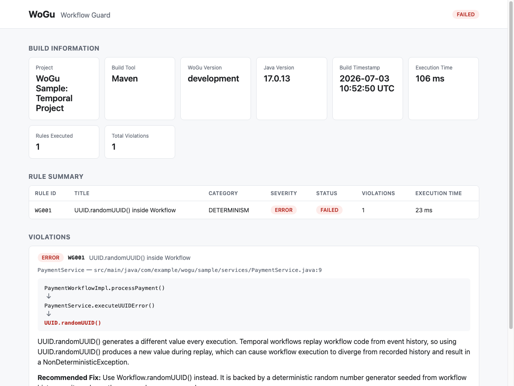
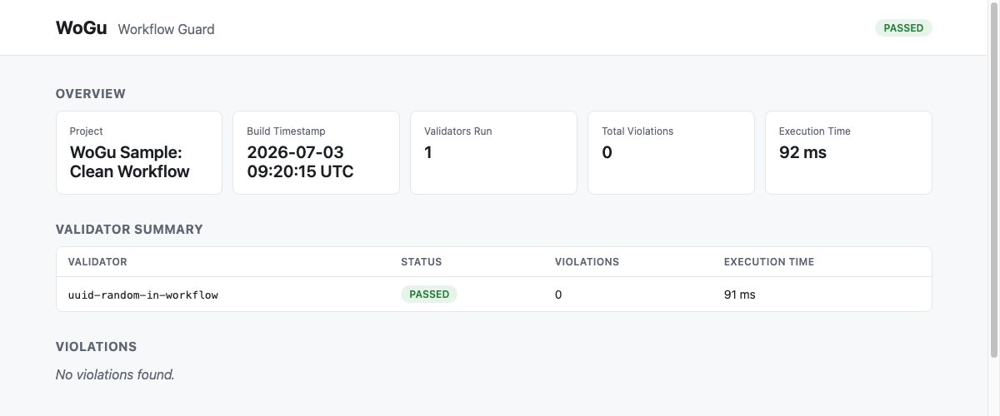

# WoGu — Workflow Guard

**Static analysis and build validation for workflow-based applications.**

WoGu plugs into your build (`mvn verify` or `gradle build`) and fails it when your
workflow code violates a deterministic-safety rule — the same way JaCoCo made coverage a
build-time concern instead of a manual check, WoGu aims to do that for workflow
correctness.

This is an initial, production-quality proof of concept targeting the
**[Temporal Java SDK](https://github.com/temporalio/sdk-java)**, with one validation rule
implemented end-to-end. The architecture is built so that many more validators — and
entirely different workflow engines (Conductor, Camunda, Airflow, ...) — can be added
without ever touching the core engine. See [Architecture](#architecture) and
[Extensibility](#adding-a-validator) below.

## Why

Temporal (and workflow engines like it) replay workflow code from history to reconstruct
state. Anything non-deterministic in that code — a random number, the wall clock, thread
scheduling — can produce a different result on replay than it did originally, silently
corrupting workflow state. These bugs are easy to write and easy to miss in review; they
belong in the build, caught automatically, every time.

## What's implemented

One validator: **`UUIDRandomValidator`** flags `UUID.randomUUID()` calls inside Temporal
workflow implementation classes (classes implementing an interface annotated
`@WorkflowInterface`), since it breaks replay determinism. The fix — `Workflow.randomUUID()`
— is deterministic and is exactly what the report suggests.

## Quick start

### Maven

```xml
<plugin>
  <groupId>io.wogu</groupId>
  <artifactId>wogu-maven-plugin</artifactId>
  <version>0.1.0-SNAPSHOT</version>
  <executions>
    <execution>
      <goals>
        <goal>validate</goal>
      </goals>
    </execution>
  </executions>
</plugin>
```

That's it — `mvn verify` now runs WoGu automatically, bound to the `verify` phase.

### Gradle

```kotlin
plugins {
  id("io.wogu.wogu-gradle-plugin") version "0.1.0-SNAPSHOT"
}
```

Applying the plugin registers `woguValidate` and, once the `java` plugin is present,
wires it into `build`.

> These artifacts aren't published to Maven Central yet (see
> [sample-temporal-project](sample-temporal-project) and [CONTRIBUTING.md](CONTRIBUTING.md)
> for how the samples in this repo consume them locally in the meantime).

## What it looks like

Console output on a build with a violation:

```
Running WoGu...

Scanning workflows...

Executing validators...

uuid-random-in-workflow

FAILED

1 violation found

WoGu report written to target/wogu/index.html

Build failed.
```

And the HTML report it writes (`target/wogu/index.html` for Maven,
`build/reports/wogu/index.html` for Gradle):

**A build with a violation:**



**A clean build:**



You can reproduce both directly from this repo — see
[sample-temporal-project](sample-temporal-project):

```bash
mvn -f sample-temporal-project/clean verify       # passes
mvn -f sample-temporal-project/violation verify   # fails, writes the report above
```

## Architecture

```
wogu-parent                  root aggregator (Maven reactor)
  wogu-api                    SPI: WorkflowValidator, ValidationContext,
                               ValidationResult, ValidationSummary, Violation, Severity.
                               Zero dependency on any engine, parser, or build tool.
  wogu-core                   ValidationEngine: discovers WorkflowValidator
                               implementations via java.util.ServiceLoader, runs them,
                               aggregates results. No compile-time reference to any
                               specific validator.
  wogu-temporal                Temporal Java SDK validators (UUIDRandomValidator today),
                               plus WorkflowImplementationScanner, shared infrastructure
                               for future Temporal-specific validators.
  wogu-report                  HtmlReportGenerator: renders a ValidationSummary as a
                               single, self-contained index.html. Depends only on
                               wogu-api, so it renders any engine's output.
  wogu-maven-plugin           The wogu:validate Maven goal (bound to verify by default).
  wogu-gradle-plugin           The woguValidate Gradle task (an independent Gradle build).
  sample-temporal-project      Real Temporal SDK code demonstrating the framework,
    clean/                     buildable with both Maven and Gradle.
    violation/
```

**Dependency direction:** `wogu-temporal` and the future `wogu-conductor` /
`wogu-camunda` / `wogu-airflow` modules depend only on `wogu-api`. `wogu-core` depends
only on `wogu-api` too, and discovers every engine's validators reflectively — it has no
import of, and no build dependency on, `wogu-temporal` or any other engine module.
`wogu-report` also depends only on `wogu-api`. The two build-tool plugins are the only
places that wire a specific set of engine jars onto the classpath (today: `wogu-temporal`),
so adding support for a new engine to an existing Maven/Gradle build is a one-line
dependency addition, not a code change.

```
wogu-maven-plugin / wogu-gradle-plugin
        │
        ├──> wogu-core   ──> wogu-api
        ├──> wogu-report ──> wogu-api
        └──> wogu-temporal ──> wogu-api      (future: wogu-conductor, wogu-camunda, ...)
```

## Adding a validator

This is the extension point the whole architecture exists to support. Adding a validator
never requires modifying `wogu-core`:

1. Implement `io.wogu.api.WorkflowValidator`.
2. Register it by adding its fully qualified class name as a line in
   `META-INF/services/io.wogu.api.WorkflowValidator` in your module.

`ValidationEngine.discover()` finds it via `ServiceLoader` — no registry to edit, no
switch statement to extend. See [CONTRIBUTING.md](CONTRIBUTING.md) for the full walkthrough,
including how to add support for an entirely new workflow engine.

## Building from source

```bash
mvn clean verify
```

builds and tests `wogu-api` through `wogu-maven-plugin`. See
[CONTRIBUTING.md](CONTRIBUTING.md) for the full repository layout, how to build the
Gradle plugin and the samples, and how to run the intentionally-failing sample.

## Requirements

Java 17+, Maven 3.9+ or Gradle 8+, Temporal Java SDK (any reasonably recent version — see
[VERSIONING.md](VERSIONING.md)).

## Project status

Proof of concept. One validator, one workflow engine. The architecture — SPI-based
validator discovery, an engine agnostic to any specific validator, a report renderer
agnostic to any specific engine — is designed to scale to many validators and multiple
workflow engines without changes to `wogu-core`.

## Contributing

See [CONTRIBUTING.md](CONTRIBUTING.md). Please also read our
[Code of Conduct](CODE_OF_CONDUCT.md).

## License

Apache License 2.0 — see [LICENSE](LICENSE).
