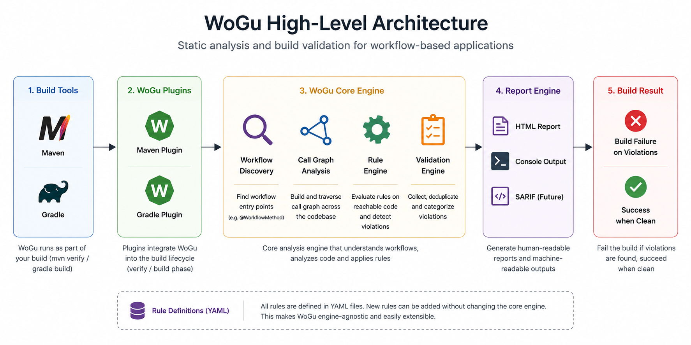

# WoGu — Workflow Guard

[](https://search.maven.org/artifact/io.github.vikas0686/wogu-maven-plugin)
[](https://github.com/vikas0686/wogu/releases)
[](LICENSE)
[](https://openjdk.org/projects/jdk/17/)
[](https://github.com/vikas0686/wogu/actions/workflows/ci.yml)

**Detect workflow determinism issues and workflow best-practice violations at build
time — before they reach production.**

WoGu plugs into your build (`mvn verify` or `gradle build`) and fails it when your
workflow code violates a workflow-quality rule — the same way JaCoCo made coverage a
build-time concern instead of a manual check, and SpotBugs made bug-pattern detection
part of the build. WoGu does that for workflow correctness. Temporal is the first
supported workflow engine, but the architecture is built so that other engines
(Conductor, Camunda, Airflow, ...) and dozens more rules can be added without ever
touching the core engine — see [Architecture](#architecture) and
[Adding a Rule](#adding-a-rule).

## Quick Demo

See WoGu catch a real violation in under 30 seconds. Console output on a build with
violations of three rules, each reached through one intermediate method call:

```
----------------------------------------------------
WoGu Workflow Guard
----------------------------------------------------
Scanning project...

✓ Found 1 workflow class

Running Rules...

✗ WG001 UUID.randomUUID() inside Workflow
✗ WG002 Thread.sleep() inside Workflow
✗ WG003 Non-deterministic Time APIs inside Workflow
----------------------------------------
3 ERROR
Build FAILED

HTML Report
target/wogu/index.html
```

And the HTML report it writes (`target/wogu/index.html` for Maven,
`build/reports/wogu/index.html` for Gradle), showing all three rules in the Rule Summary
and a call path from the workflow's entry point down to each offending call — rendered
with no report-generator changes, since it reads purely from `Rule` metadata:


Reproduce this directly from this repo — see
[sample-temporal-project](sample-temporal-project), whose workflow method calls into a
service class that violates all three rules:

```bash
mvn -f sample-temporal-project verify   # fails by design, writes the report above
```

## Installation

WoGu is published on Maven Central under `io.github.vikas0686`.

### Maven

```xml
<plugin>
  <groupId>io.github.vikas0686</groupId>
  <artifactId>wogu-maven-plugin</artifactId>
  <version>0.1.0</version>
  <executions>
    <execution>
      <goals>
        <goal>validate</goal>
      </goals>
    </execution>
  </executions>
</plugin>
```

That's it — `mvn verify` now runs WoGu automatically, bound to the `verify` phase. No
extra repository configuration is needed; it resolves straight from Maven Central.

### Gradle

```kotlin
plugins {
  id("io.wogu.wogu-gradle-plugin") version "0.1.0"
}
```

Applying the plugin registers `woguValidate` and, once the `java` plugin is present,
wires it into `build`.

> The Gradle plugin isn't published to the Gradle Plugin Portal yet — see
> [CONTRIBUTING.md](CONTRIBUTING.md) for how to build and consume it locally from
> `mavenLocal()` in the meantime. The Maven plugin above is fully published and needs no
> local setup.

## Quick Start

1. Add the plugin — see [Installation](#installation) above.
2. Run:
   ```bash
   mvn verify
   ```
3. Open the report:
   ```
   target/wogu/index.html
   ```

Done — no configuration required for the default rule set.

## Example

```java
// Inside a workflow implementation
UUID.randomUUID();
```

↓ `mvn verify` fails
↓ HTML report shows the violation and its full call path
↓ Recommended fix: `Workflow.randomUUID()`

See [Supported Rules](#supported-rules) below for everything WoGu checks for today.

## Building from Source

```bash
mvn clean verify
```

builds and tests `wogu-api` through `wogu-maven-plugin`. See
[CONTRIBUTING.md](CONTRIBUTING.md) for the full repository layout, how to build the
Gradle plugin and the samples, and how to run the intentionally-failing sample.

## Supported Rules

Ten Determinism rules for the Temporal Java SDK, all reachable-from-a-workflow-entry-
point checks built on the same [Call Graph Analysis](#call-graph-analysis) engine — not
just direct usage inside the workflow implementation class, but calls (and
constructions) several methods away, and never a false positive from code inside an
Activity implementation:

| Rule | Flags | Fix |
|---|---|---|
| [WG001](docs/rules/WG001.md) | `UUID.randomUUID()` | `Workflow.randomUUID()` |
| [WG002](docs/rules/WG002.md) | `Thread.sleep(...)` | `Workflow.sleep(Duration)` |
| [WG003](docs/rules/WG003.md) | `System.currentTimeMillis()`, `Instant.now()`, `LocalDate.now()`, `LocalDateTime.now()`, `OffsetDateTime.now()`, `ZonedDateTime.now()`, `Clock.systemUTC()`, `Clock.systemDefaultZone()` | `Workflow.currentTimeMillis()` |
| [WG004](docs/rules/WG004.md) | `Math.random()` | `Workflow.newRandom()` |
| [WG005](docs/rules/WG005.md) | `new Random()`, `Random.nextInt()/nextLong()/nextDouble()/nextBoolean()` | `Workflow.newRandom()` |
| [WG006](docs/rules/WG006.md) | `ThreadLocalRandom.current()` | `Workflow.newRandom()` |
| [WG007](docs/rules/WG007.md) | `new SecureRandom()`, `SecureRandom.nextBytes()/nextInt()` | `Workflow.newRandom()` (or an Activity, for genuine cryptographic randomness) |
| [WG008](docs/rules/WG008.md) | `System.getenv()` | Read config outside the workflow or via an Activity |
| [WG009](docs/rules/WG009.md) | `System.getProperty(...)` | Read config outside the workflow or via an Activity |
| [WG010](docs/rules/WG010.md) | `Executors.new*ThreadPool/Executor()`, `new Thread(...)`, `CompletableFuture.supplyAsync(...)`, `ForkJoinPool.commonPool()` | Temporal `Async` APIs |

Each is a self-contained addition to `TemporalWorkflowValidator`'s rule list — none of
them required a change to `wogu-core`, `wogu-report`, or either build-tool plugin (see
[Adding a Rule](#adding-a-rule)).

## Architecture



Build tools invoke a WoGu plugin, which discovers workflow classes, traverses their call
graph, evaluates every rule against it, and reports results back to the build — every
rule is a YAML definition, so adding one never touches this pipeline.

| Module | What it is |
|---|---|
| `wogu-parent` | Root aggregator (Maven reactor). |
| `wogu-api` | SPI: `WorkflowValidator`, `Rule`, `RuleCategory`, `RuleResult`, `ValidatorRunOutcome`, `ValidationContext`, `ValidationSummary`, `Violation`, `CallPathFrame`, `Severity`. Zero dependency on any engine, parser, or build tool. |
| `wogu-core` | `ValidationEngine`: discovers `WorkflowValidator` implementations via `java.util.ServiceLoader`, runs them, aggregates their `RuleResult`s. `ConsoleReportRenderer`: the console output shared by both build-tool plugins. No compile-time reference to any specific validator or rule. |
| `wogu-temporal` | Temporal Java SDK rules (WG001–WG010 today, all declared as YAML under `src/main/resources/rules` and executed by the generic `ForbiddenMethodRule`), the reusable `CallGraphAnalyzer` engine, `RuleRegistry`/`RuleDefinitionLoader`, `WorkflowImplementationScanner`, and `ActivityAwareness` (the call-graph traversal boundary at an Activity implementation) — shared infrastructure for future Temporal-specific rules. |
| `wogu-report` | `HtmlReportGenerator`: renders a `ValidationSummary` as a single, self-contained `index.html` — Build Information, a Rule Summary table, and a detail card per violation (including its call path). Depends only on `wogu-api`, so it renders any engine's output; adding a rule never requires a report change. |
| `wogu-maven-plugin` | The `wogu:validate` Maven goal (bound to `verify` by default). |
| `wogu-gradle-plugin` | The `woguValidate` Gradle task (an independent Gradle build). |
| `sample-temporal-project` | Real Temporal SDK code demonstrating a violation reached through an intermediate service class. |
| `docs/rules/` | One Markdown page per rule (`WG001.md` is the template). |

**Dependency direction:** `wogu-temporal` and the future `wogu-conductor` /
`wogu-camunda` / `wogu-airflow` modules depend only on `wogu-api`. `wogu-core` depends
only on `wogu-api` too, and discovers every engine's validators reflectively — it has no
import of, and no build dependency on, `wogu-temporal` or any other engine module.
`wogu-report` also depends only on `wogu-api`. The two build-tool plugins are the only
places that wire a specific set of engine jars onto the classpath (today: `wogu-temporal`),
so adding support for a new engine to an existing Maven/Gradle build is a one-line
dependency addition, not a code change.

| Depends on `wogu-api` only | Depends on `wogu-core` + `wogu-report` + `wogu-temporal` |
|---|---|
| `wogu-core`, `wogu-report`, `wogu-temporal` (future: `wogu-conductor`, `wogu-camunda`, `wogu-airflow`) | `wogu-maven-plugin`, `wogu-gradle-plugin` |

## Why WoGu?

Temporal (and workflow engines like it) replay workflow code from history to reconstruct
state. Anything non-deterministic in that code — a random number, the wall clock, thread
scheduling — can produce a different result on replay than it did originally, diverging
execution from recorded history. These bugs are easy to write and easy to miss in review;
they belong in the build, caught automatically, every time.

## Call Graph Analysis

WoGu doesn't just check the workflow class itself: starting from a workflow's entry
point, it follows every method call it can resolve to source elsewhere in the project,
however many hops deep, to catch a violation hidden behind a helper class or service —
and it knows to stop at the boundary of a Temporal Activity implementation, so Activity
code (which isn't replayed) is never flagged.

→ Full details, with examples: [docs/call-graph-analysis.md](docs/call-graph-analysis.md)

## Rules, Not Validators

A single `WorkflowValidator` implementation commonly evaluates several rules in one pass
— sharing one parse of the source, one workflow scan, one call graph — because most of
that setup is identical across rules for the same engine. `Rule` (id, title, category,
severity, engine, since-version, documentation reference, auto-fix availability) and
`RuleResult` are what the report and future configuration key off of, not the validator
implementation. Every rule id is `WG###`, and each `RuleCategory` (Determinism,
Activities, Versioning, Signals, Updates, Performance, Best Practices, Security,
Organization Policies) reserves a fixed numeric range — enforced by `Rule`'s constructor,
not just documented (see [CONTRIBUTING.md](CONTRIBUTING.md#rule-numbering) for the exact
ranges).

## Adding a Rule

Most rules need no Java at all: a "flag this method call or constructor" rule is a small
YAML file under `wogu-temporal/src/main/resources/rules`, executed by one generic
`ForbiddenMethodRule` — dropping in a new file is the entire change, no registration
step anywhere. Only a rule needing real analysis logic beyond a method-call/constructor
pattern extends the `CustomRule` base class instead.

→ Full details, with a YAML example: [docs/adding-a-rule.md](docs/adding-a-rule.md)

## Requirements

Java 17+, Maven 3.9+ or Gradle 8+, Temporal Java SDK (any reasonably recent version — all
ten rules' detection is source-based and has no compile-time dependency on the SDK
itself; see [VERSIONING.md](VERSIONING.md)).

## Project Status

WoGu is in active development and the first public release (**v0.1.0**) is available on Maven Central.

### Current capabilities

- ✅ 10 Temporal workflow determinism rules
- ✅ Maven plugin
- ✅ Gradle plugin
- ✅ Recursive call graph analysis
- ✅ HTML reporting
- ✅ Build-time quality gate
- ✅ Extensible YAML-based rule framework

### Planned

- Activity validation rules
- Workflow versioning rules
- Performance rules
- Additional workflow engine support (Camunda, Conductor, Airflow, and others)
- Rule configuration (enable/disable rules, suppressions, project policies)

## Roadmap

- **v0.1** ✅ Temporal Determinism Rules (WG001–WG010) — shipped, published to Maven Central
- **v0.2** ⬜ Activity Rules
- **v0.3** ⬜ Versioning Rules
- **v0.4** ⬜ Performance Rules
- **v1.0** ⬜ 50+ Rules across Determinism, Activities, Versioning, Signals, Updates, Performance, Best Practices, Security, and Organization Policies

No dates are committed yet — see [Project Status](#project-status) above for where
things stand today.

## Contributing

See [CONTRIBUTING.md](CONTRIBUTING.md). Please also read our
[Code of Conduct](CODE_OF_CONDUCT.md).

## License

Apache License 2.0 — see [LICENSE](LICENSE).
